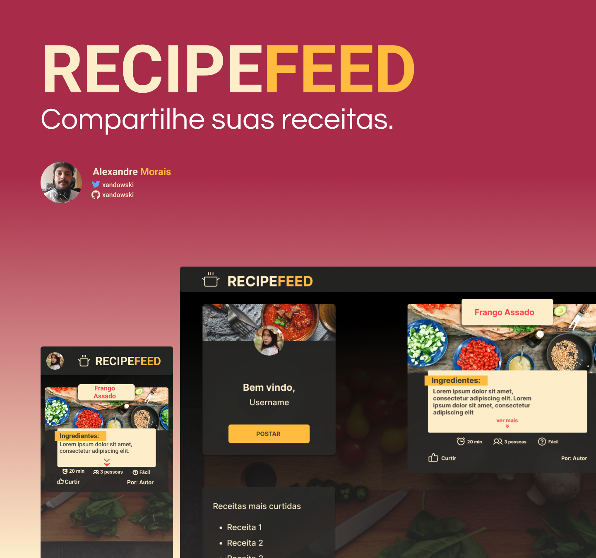

<div align="center">


This application is a personal project, to study graphql and relay. I also created the figma layout to learn more about the tool and design.

</div>

<div align="center">

[]()
[]()
[]()

</div>

## 🛠 Build with

<p align="center">
  <a href="https://www.typescriptlang.org/docs/">
    
  </a>
  <a href="https://nodejs.org/en/">
    
  </a>
  <a href="https://reactjs.org/docs/getting-started.html">
    
  </a>
  <a href="">
    
  </a>
  <a href="https://auth0.com/docs/">
    
  </a>
  <a href="https://vitejs.dev/">
    
  </a>
  <a href="https://www.prisma.io/">
    
  </a>
  <a href="https://graphql.org/learn/">
    
  </a>
   <a href="https://relay.dev/">
    
  </a>
  <a href="http://koajs.com/">
    
  </a>
  <a href="https://relay.dev/">
    
  </a>
 
</p>

## 📃 About

Recipefeed is an application for users to share their recipes 😋👨‍🍳👩‍🍳.

## 🎨 Layout

- [Layout Figma](https://www.figma.com/community/file/1158965316952351569)

<div align="center">
  
</div>

## ⚙ Features

Soon...

## 💻 Getting started

```sh
git clone https://github.com/xandowski/rercipefeed.git && cd recipefeed
```

to run frontend:

```sh
cd web
yarn
yarn dev
```

# 🚧 Under development
